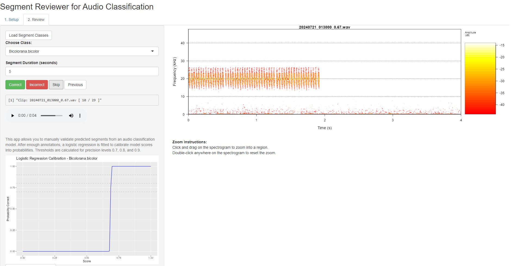

# Validation Aplication for model predictions created with Autrainer models
## R Scripts and Shiny App for manual validation of predictions from autrainer models

This is work in progress. If you encounter any problems or can think of improvements, feel free to email me: dominik.arend@bio.uni-freiburg.de

## Theoretical Background
Machine learning classifiers, including sound recognition models like BirdNET, InsectNet or custom Bio/Geo/Anthropophony classifiers, typically produce confidence scores between 0 and 1. While these resemble probabilities, they are actually unitless values resulting from a transformation (often a sigmoid) of the model's internal logits. These scores are not directly interpretable as probabilities because their calibration depends on the data distribution, the model's architecture, and the class it predicts. For instance, a score of 0.8 might indicate high confidence for one species but a much lower actual correctness probability for another.

To address this, Wood & Kahl (2024) recommend post hoc calibration using logistic regression, where validated predictions (labeled correct/incorrect by humans) are modeled against their original confidence scores. This approach transforms abstract model outputs into real-world probabilities of correctness, allowing thresholds to be set for desired precision levels (e.g., 0.9). This process makes model outputs actionable for ecological monitoring, where knowing the reliability of detections is more important than just their frequency. These principles are broadly applicable to other audio classifiers beyond BirdNET.

### Logistic regression
Logistic Regression Equation

Let:

    p = probability prediction is correct

    score = BirdNET or other model score (e.g., [0–1])

    outcome = 1 if prediction was correct, 0 if incorrect

Then:

    model <- glm(outcome ~ score, family = "binomial", data = validation_data)
    threshold_for_0.9 <- (log(0.9 / (1 - 0.9)) - coef(model)[1]) / coef(model)[2]

## App Workflow
1. Export audio segments and their scores.
2. Let users manually validate them.
3. Use logistic regression to calibrate prediction scores into real-world probabilities.
4. Precision thresholds (e.g., for 0.7, 0.8, 0.9 probability) are displayed for the user to choose.

# Help: How this app works

**Purpose**  
This tool helps validate segments predicted by a machine learning model.
Mainly for model prediction made with Autrainer. For Example:

- 

- Each audio clip was predicted to belong to a class (e.g., a species or sound type).
- The reviewer listens and marks each prediction as Correct or Incorrect.

**Under the hood**  
- A **logistic regression** is fit using the validated clips to convert scores into probabilities.

- A **calibration curve** (score vs. probability) is plotted.

- You also get thresholds for 0.7, 0.8, and 0.9 probability of correctness.

- The **Precision-Recall (ROC) Curve** helps evaluate model performance across thresholds.


# Installation

## Installation of R-Shiny app
Download the R-Script "Segment_reviewer_app.R" for the segment reviewer app and the R-Scrpt "Segment_extraction" for streamlined extraction of segment from the github and store it on your machine.
Open the R Scripts with R-Studio or to your liking. In R-Studio, press "Run" 

## Prerequisites and File Setup

Before launching the Shiny app, make sure your working directory includes the following:

### 1. `exported_segments/` Directory

This should contain subfolders named by class labels (e.g., species, sound types), with 3-second audio `.wav` clips. Example structure:

```

exported\_segments/
├── Insecta/
│   ├── forestrec1\_0.91.wav
│   ├── forestrec5\_0.83.wav
│   └── ...
├── Geophony/
│   ├── canyon1\_0.77.wav
│   └── ...
└── Anthropophony/
├── roadnoise\_0.68.wav
└── ...

````

- File names should include a score, typically appended as part of the name: `recordingID_score.wav` (e.g., `rec1_0.84.wav`).
- Each file must be exactly the same duration (default = 3 seconds).
- Audio files must be in `.wav` format.

### 2. `validation_results.csv` (optional)

If you’ve already started a validation session, this file will be updated when the app closes. You don’t need to create it beforehand.

### 3. Required R Packages

Make sure the following R packages are installed:

```r
install.packages(c(\"shiny\", \"tuneR\", \"seewave\", \"dplyr\", \"ggplot2\", \"pROC\"))
```

## Launching the App

Once everything is set up, launch the app in R:

```r
shiny::runApp(\".\")  # If app.R and help.md are in the current folder
```

you should now see two "pages", selectable at the top of the window

First, select the repository

Secondly, start annotating



## Additional Notes

* The app will automatically recognize available class subfolders.
* Logistic regression calibration will begin displaying after 10 reviewed segments.
* Logistic regression and ROC/PR curves are refreshed live as you label clips.

## Literature
Wood, C.M., Kahl, S. Guidelines for appropriate use of BirdNET scores and other detector outputs. J Ornithol 165, 777–782 (2024). https://doi.org/10.1007/s10336-024-02144-5